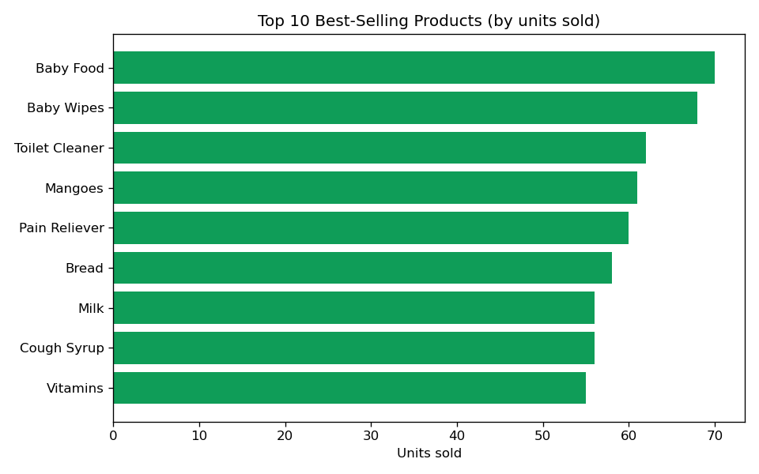
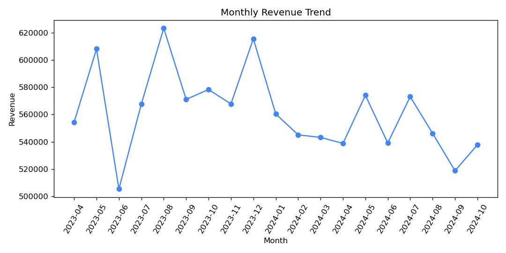
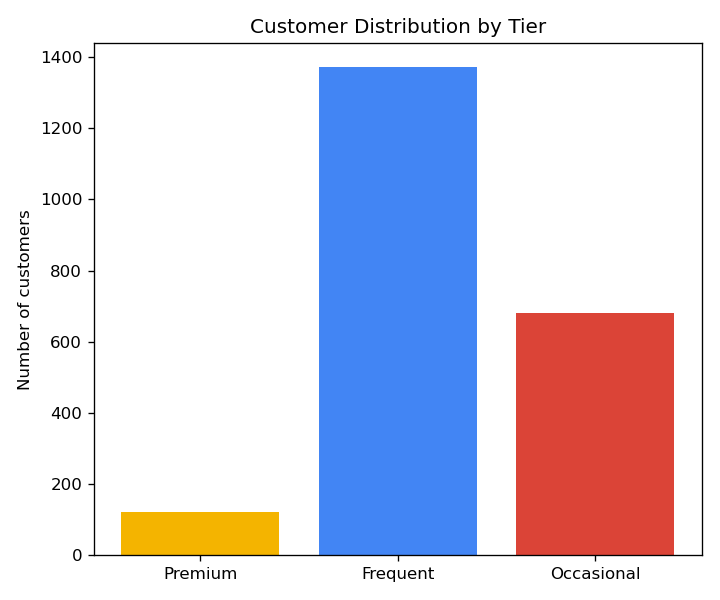
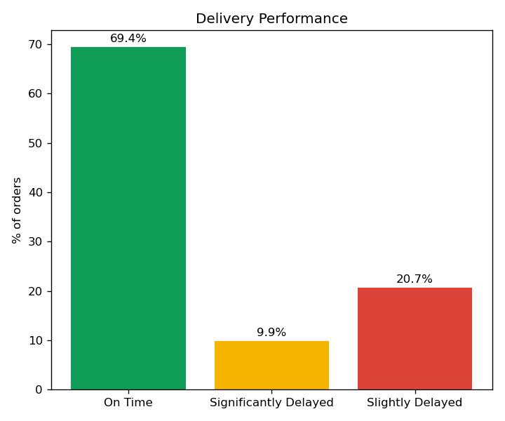

# 🛒 Blinkit Groceries App Sales Analysis (SQL + Python)

A relational database analysis project combining **SQL** (schema design, data modeling, and querying in MySQL/MariaDB) with **Python** (visualization and reporting), built on Kaggle's *Blinkit Sales Dataset*.

---

## 📌 Business question

Which products and customers are driving the business, how reliable is delivery performance, and where are the opportunities (underperforming products, at-risk delivery times, low-engagement customers)?

---

## 🗂️ Database structure

A 5-table relational schema modeled and built from scratch in MySQL:

| Table | Description |
|---|---|
| `customers` | 2,500 registered customers |
| `products` | 268 products across multiple categories |
| `orders` | 5,000 orders with payment method, total, and delivery status |
| `order_items` | Line-item detail linking orders to products |
| `delivery_performance` | Delivery time, distance, and delay reasons per order |

See [`schema.sql`](./schema.sql) for full table definitions and the complete set of analysis queries.

---

## 🛠️ Tools & techniques

- **MySQL / MariaDB** (via XAMPP) — schema design, primary/foreign keys, CTEs (`WITH`), `CASE` classification, subqueries, `JOIN`s
- **Python** — `SQLAlchemy` + `mysql-connector-python` to query the database directly, `Pandas` for data handling, `Matplotlib` for visualization
- **Jupyter Notebook** — [`blinkit_analysis.ipynb`](./blinkit_analysis.ipynb) contains the full workflow: connect → query → visualize, with results and charts rendered inline

---

## 📊 Data source

Public dataset sourced from **Kaggle**: [Blinkit Sales Dataset](https://www.kaggle.com/datasets/akxiit/blinkit-sales-dataset), covering ~20 months of order history (March 2023 – November 2024).

---

## 🖼️ Charts

---

## 💡 Key insights

- **Everyday essentials dominate sales** — *Baby Food*, *Baby Wipes*, and *Toilet Cleaner* are the top 3 best-selling products by units sold.
- **No dead stock** — every product in the 268-item catalog sold at least once, meaning inventory isn't sitting idle.
- **Revenue is stable, not seasonal** — monthly revenue holds steady in the ~505K–623K range across nearly two years, with no strong upward or downward trend.
- **Customer base skews "Frequent"** — of 2,500 customers, 1,371 are Frequent buyers (2-4 orders), 680 are Occasional (a re-engagement opportunity), and 121 are Premium (5+ orders).
- **Delivery reliability has room to improve** — 69% of orders arrive on time, but nearly 1 in 10 (9.9%) are significantly delayed — worth flagging as an operational risk and worthy of an evaluation.
---

## 👤 Author

**Rafa** — Jr. Data Analyst | Former Architect
[GitHub](https://github.com/rafaelDiazDeLeon) · LinkedIn: [rafaelDiazDeLeon](https://www.linkedin.com/in/rafael-díaz-de-león-arriaga-bb7948125/)
